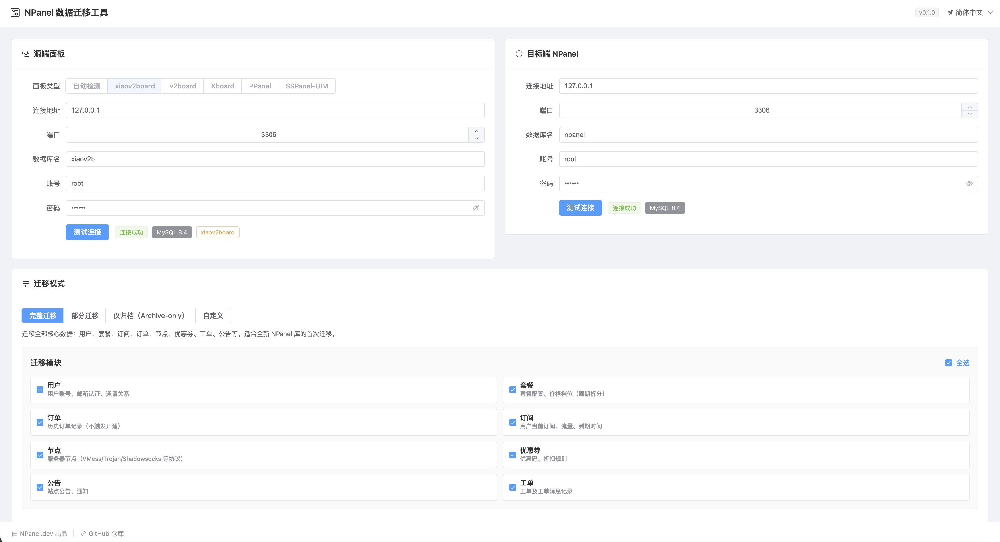
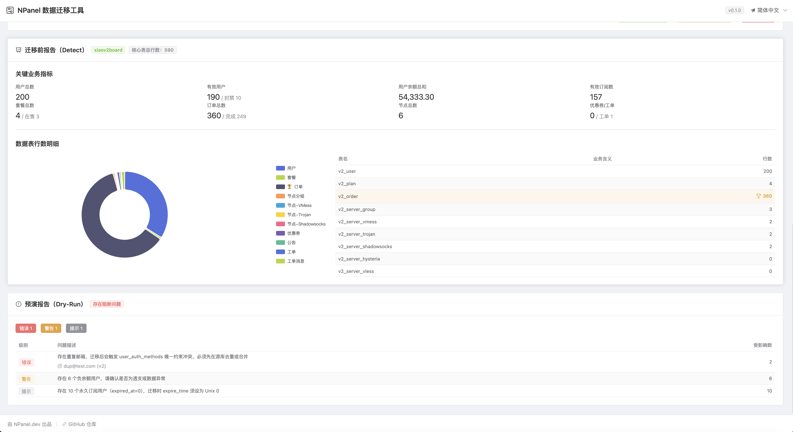
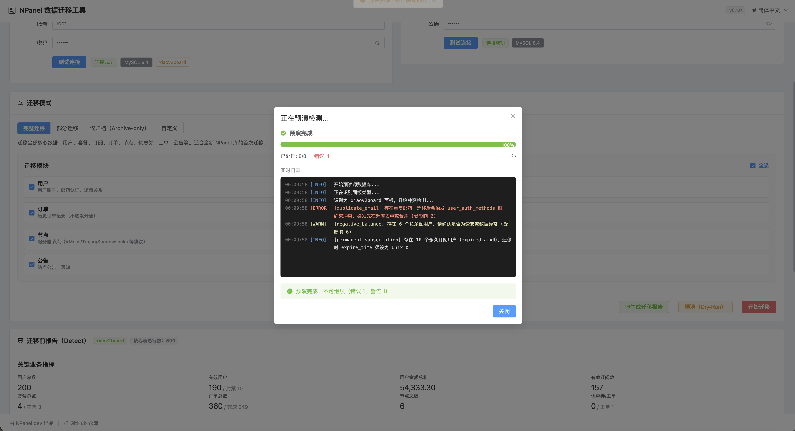

# NPanel Migrator

NPanel Migrator is a migration tool for importing data from legacy proxy panels into NPanel. It provides a web UI, source/target database connection checks, pre-migration detection, dry-run validation, and a guided import workflow.

中文说明见下方：[中文](#中文)

## Showcase







## English

### Current Status

| Source panel | Status | Notes |
| --- | --- | --- |
| xiaov2board | Supported | Implemented for users, plans, subscriptions, orders, node groups, nodes, coupons, notices, and tickets. |
| v2board | Planned | Schema detection exists in the design scope, but import is not currently enabled as a completed adapter. |
| Xboard | Planned | Not yet implemented. |
| PPanel | Planned | Not yet implemented. |
| SSPanel-UIM | Planned | Not yet implemented. |

### What It Does

The system migrates a source panel database into an NPanel target database through a three-layer pipeline:

1. Source adapter: reads panel-specific tables and converts them into a canonical migration model.
2. Canonical model: normalizes users, plans, orders, subscriptions, nodes, groups, coupons, notices, and tickets.
3. NPanel writer: writes normalized data into the NPanel schema through the NPanel Ent client.

For xiaov2board, the migrator currently covers:

- Users: accounts, password hash metadata, balance, commission balance, Telegram ID, referral code, inviter relation, admin flag, and enabled/disabled status.
- Plans: plan metadata, traffic, speed limit, device limit, sale/show state, sorting, price options split from xiaov2board period price columns.
- Subscriptions: current user subscription state from `v2_user`, token, UUID, traffic usage, expiration time, status, order link, and node group assignment.
- Orders: historical order records, payment metadata, amount fields, status mapping, and plan/user references.
- Node groups: `v2_server_group` is migrated into NPanel `node_group`.
- Nodes: `servers` and `nodes` records are generated from xiaov2board protocol tables.
- Supported xiaov2board node tables: `v2_server_vmess`, `v2_server_trojan`, `v2_server_shadowsocks`, `v2_server_hysteria`, `v2_server_vless`, `v2_server_tuic`, `v2_server_anytls`, and `v2_server_v2node`.
- Node permissions: source `group_id` values are mapped into NPanel `nodes.node_group_ids`, and plan/subscription group fields are also mapped where available.
- Coupons, notices, tickets, and ticket messages.

### Safety Features

- Connection testing for source and target databases.
- Panel detection and core table row counting.
- Dry-run checks before import.
- Progress tracking and real-time import logs.
- Batch user/order extraction to avoid loading large tables into memory at once.
- Target schema creation through NPanel Ent migrations.
- Migration source maps for user, plan, order, and node group references.

### Project Structure

```text
Npanel-migrator/
  Server/                 Go backend and migration engine
    cmd/npanel-migrator/  Application entrypoint
    internal/adapter/     Source panel adapters
    internal/data/        Canonical model, DB helpers, NPanel writers
    internal/server/      HTTP routes and embedded frontend assets
    internal/service/     Detect, dry-run, import orchestration
  Vue/                    Vue 3 + TypeScript frontend
  doc/                    Migration design documents
```

### Requirements

- Go matching the version declared in `Server/go.mod`.
- pnpm for frontend builds.
- `wire` for dependency injection code generation.
- Access to the source panel MySQL/MariaDB database.
- Access to the target NPanel MySQL/MariaDB database.
- A local NPanel backend checkout if using the current `replace github.com/npanel-dev/NPanel-backend => /Users/mac/Project/Go/NP/NPanel-backend` directive in `Server/go.mod`.

### Build

```bash
cd Server
make build
```

The build process:

1. Installs/builds the Vue frontend.
2. Copies `Vue/dist` into `Server/internal/server/assets`.
3. Runs `wire`.
4. Builds a single Go binary at `Server/bin/npanel-migrator`.

### Run Locally

```bash
cd Server
make run
```

Default server config lives in:

```text
Server/configs/config.yaml
```

By default, the HTTP server listens on `0.0.0.0:8000`.

### Important Notes

- Back up both source and target databases before running a real migration.
- Run detect and dry-run before import.
- Use a fresh target database for first full migrations whenever possible.
- xiaov2board support is the currently implemented and verified adapter path.
- Other panel families are part of the design roadmap but should not be treated as supported until their adapters are implemented and tested.

## 中文

### 当前支持状态

| 源面板 | 状态 | 说明 |
| --- | --- | --- |
| xiaov2board | 已支持 | 已实现用户、套餐、订阅、订单、节点分组、节点、优惠券、公告、工单迁移。 |
| v2board | 规划中 | 设计范围内已有识别和迁移规划，但当前未作为完整可用 adapter 启用。 |
| Xboard | 规划中 | 暂未实现。 |
| PPanel | 规划中 | 暂未实现。 |
| SSPanel-UIM | 规划中 | 暂未实现。 |

### 系统定位

NPanel Migrator 是用于把旧代理面板数据迁移到 NPanel 的迁移工具。它包含 Web 管理界面、源库/目标库连接测试、迁移前检测、Dry-Run 预演、正式导入、实时日志和进度展示。

系统迁移链路分为三层：

1. 源端 adapter：读取不同面板自己的表结构。
2. canonical model：转换成统一的中间数据模型。
3. NPanel writer：通过 NPanel Ent client 写入目标 NPanel 表结构。

### xiaov2board 已支持功能

当前已经支持 xiaov2board 迁移到 NPanel，覆盖以下数据：

- 用户：账号主体、密码 hash 元信息、余额、佣金余额、Telegram ID、邀请码、邀请人关系、管理员标记、启用/禁用状态。
- 套餐：套餐名称、描述、流量、限速、设备数、显示/售卖状态、排序、周期价格拆分为 NPanel 价格档位。
- 用户订阅：从 `v2_user` 当前订阅状态抽取，迁移 token、UUID、流量用量、到期时间、状态、关联订单、节点分组。
- 订单：历史订单、支付方式、交易号、金额、状态、用户/套餐引用关系。
- 节点分组：把 `v2_server_group` 迁移到 NPanel 的 `node_group` 表。
- 节点：从 xiaov2board 各协议节点表生成 NPanel `servers` 和 `nodes`。
- 已支持节点表：`v2_server_vmess`、`v2_server_trojan`、`v2_server_shadowsocks`、`v2_server_hysteria`、`v2_server_vless`、`v2_server_tuic`、`v2_server_anytls`、`v2_server_v2node`。
- 节点权限：源节点 `group_id` 会映射到 NPanel `nodes.node_group_ids`；套餐和用户订阅上的节点组字段也会同步映射。
- 优惠券、公告、工单、工单消息。

### 迁移安全能力

- 源库和目标库连接测试。
- 面板类型检测和核心表行数统计。
- 正式导入前 Dry-Run 预演。
- 实时导入进度和日志。
- 用户和订单支持分批读取，避免大表一次性载入内存。
- 通过 NPanel Ent schema 自动创建目标表结构。
- 维护用户、套餐、订单、节点分组的源 ID 到目标 ID 映射账本。

### 目录结构

```text
Npanel-migrator/
  Server/                 Go 后端和迁移引擎
    cmd/npanel-migrator/  程序入口
    internal/adapter/     源面板 adapter
    internal/data/        canonical 模型、数据库工具、NPanel 写入器
    internal/server/      HTTP 路由和内嵌前端资源
    internal/service/     检测、预演、导入编排
  Vue/                    Vue 3 + TypeScript 前端
  doc/                    迁移设计文档
```

### 环境要求

- Go 版本以 `Server/go.mod` 为准。
- pnpm，用于构建前端。
- `wire`，用于生成依赖注入代码。
- 可连接源面板 MySQL/MariaDB 数据库。
- 可连接目标 NPanel MySQL/MariaDB 数据库。
- 如果保留当前 `Server/go.mod` 里的 `replace github.com/npanel-dev/NPanel-backend => /Users/mac/Project/Go/NP/NPanel-backend`，本机需要存在对应 NPanel-backend checkout；否则需要按实际环境调整该 replace 路径。

### 构建

```bash
cd Server
make build
```

构建流程会：

1. 安装并构建 Vue 前端。
2. 把 `Vue/dist` 复制到 `Server/internal/server/assets`。
3. 执行 `wire` 生成依赖注入代码。
4. 构建单二进制 `Server/bin/npanel-migrator`。

### 本地运行

```bash
cd Server
make run
```

默认配置文件：

```text
Server/configs/config.yaml
```

默认监听地址是 `0.0.0.0:8000`。

### 使用注意

- 正式迁移前必须备份源库和目标库。
- 建议先执行检测和 Dry-Run，再执行正式导入。
- 首次完整迁移建议使用全新的 NPanel 目标库。
- 当前完整支持的是 xiaov2board 到 NPanel。
- v2board、Xboard、PPanel、SSPanel-UIM 等面板属于后续规划，未实现完整 adapter 前不要按已支持能力使用。
